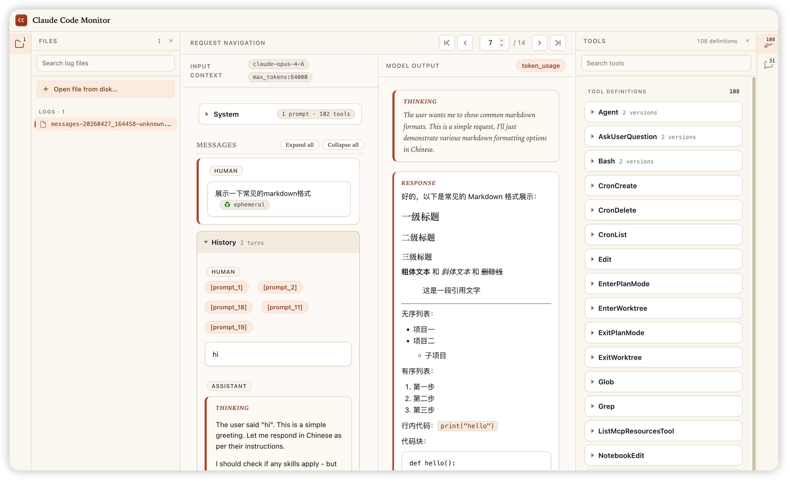

# Claude Code Monitor

[](./README.zh-CN.md)

Claude Code Monitor is a local observability tool for Claude Code. It runs an Anthropic-compatible proxy between Claude Code and the real upstream service, records system prompts, messages, tool definitions, tool calls, streaming responses, and token usage, then lets you inspect them in a browser.

It is designed for two workflows:

- **One-off debugging**: quickly inspect what Claude Code sent and received for a single run. Use `cc-monitor -p "..."` or `cc-monitor --resume` without changing your Claude Code user or project settings.
- **Long-running monitoring**: keep a local proxy running and explicitly point Claude Code at it for ongoing log capture. Use `cc-monitor proxy`, then start Claude Code with the generated settings file or an environment variable.

Why use it:

- **Zero-config by default**: it can discover the real base URL used by your existing Claude Code setup.
- **Non-invasive**: it does not patch Claude Code; one-shot mode does not write to `~/.claude/settings.json` or project `.claude/settings.json`.
- **Full request visibility**: inspect system prompts, message history, tool schemas, tool calls, streaming output, and token usage.
- **Useful for tool/MCP debugging**: verify the exact tool definitions and prompts Claude Code sent to the model.
- **Local-first**: runtime config and logs live in `~/.claude-code-monitor/`.

## Preview



The visualizer splits each Claude Code request into input context, model output, and resources. You can inspect system prompts, messages, tool definitions, token usage, and collapse long message history when reviewing larger sessions.

## Install

```bash
npm install -g cc-monitor
```

From a local checkout:

```bash
npm install
npm install -g .
```

The npm package name and installed command are both `cc-monitor`.

## Usage

Use one CLI prefix for both monitor commands and Claude Code passthrough. There are two recommended modes.

### Mode 1: One-Off Claude Code Debugging

This is the simplest mode for temporary prompt, tool, MCP, or token usage debugging.

```bash
cc-monitor
cc-monitor -p "hello"
cc-monitor --resume
```

One-shot mode:

1. Starts the local proxy, default `http://localhost:18888`.
2. Starts the log visualizer, default `http://127.0.0.1:5500`.
3. Opens the browser.
4. Launches Claude Code and passes your Claude Code arguments through unchanged.

Except for monitor subcommands (`proxy`, `stop`, `status`, `viz`, `extract`, `config`, `help`), every argument is passed through to Claude Code automatically. Any Claude Code flag can be appended directly to `cc-monitor`.

This mode does not modify your Claude Code user or project settings. It only injects the proxy environment into the launched Claude Code process and uses `~/.claude-code-monitor/settings.json` as a generated settings file. To stop the background proxy, run:

```bash
cc-monitor stop
```

### Mode 2: Long-Running Proxy Monitoring

If you want Claude Code to keep using the same local proxy over time, start the proxy manually.

```bash
cc-monitor proxy
```

The command generates:

```text
~/.claude-code-monitor/settings.json
```

Start Claude Code with that settings file:

```bash
claude --settings ~/.claude-code-monitor/settings.json
```

Or configure only the current shell session:

```bash
ANTHROPIC_BASE_URL=http://localhost:18888 claude
```

Open the monitor UI:

```bash
cc-monitor viz
```

Default URL:

```text
http://127.0.0.1:5500
```

Long-running mode is better for continuous monitoring. One-shot mode is better for temporary, no-config debugging.

Stop the proxy:

```bash
cc-monitor stop
```

Check status:

```bash
cc-monitor status
```

## CLI Help

Every monitor subcommand has dedicated help:

```bash
cc-monitor --help
cc-monitor proxy --help
cc-monitor help proxy
```

Command reference:

| Command | What it does | When to use it |
| --- | --- | --- |
| `cc-monitor` | Starts the proxy, visualizer, and Claude Code | One-off debugging; append Claude Code args such as `-p` or `--resume` directly |
| `cc-monitor proxy` | Starts only the local API proxy | Long-running monitoring where you explicitly configure Claude Code to use the proxy |
| `cc-monitor stop` | Stops monitor-managed background services | Stop the proxy without killing unrelated processes on the same port |
| `cc-monitor status` | Shows proxy PID and port ownership | Check whether the proxy is running or whether another process owns the port |
| `cc-monitor viz` | Starts/opens the log visualizer | Inspect existing logs without launching Claude Code |
| `cc-monitor extract [log-file]` | Extracts prompts and tools from logs | Uses the newest log by default, or a specific file when provided |
| `cc-monitor config` | Prints the resolved config | Verify ports, target base URL, visualizer settings, and env overrides |

The visualizer opens automatically during one-click startup. Set `CLAUDE_MONITOR_OPEN_BROWSER=false` to disable that behavior.
Startup output is intentionally brief. Set `CLAUDE_MONITOR_VERBOSE=true` to print process IDs, log paths, and startup steps.

## User Directory

Runtime data is stored outside the repository:

```text
~/.claude-code-monitor/
  config.json       # user config
  settings.json     # generated Claude Code settings file
  logs/             # proxy and visualizer process logs
  raw_logs/         # captured API interactions
  prompts/          # extracted prompts and tools
```

`config.json` is optional. By default, `cc-monitor` discovers the target Anthropic-compatible base URL from your existing Claude Code environment and settings.

Target discovery priority:

```text
CLAUDE_MONITOR_TARGET_BASE_URL
> ~/.claude-code-monitor/config.json target.baseUrl
> ANTHROPIC_BASE_URL from the current shell
> Claude Code settings env.ANTHROPIC_BASE_URL
  - custom --settings file
  - .claude/settings.local.json
  - .claude/settings.json
  - ~/.claude/settings.json
> https://api.anthropic.com
```

Example `~/.claude-code-monitor/config.json` for manual overrides:

```json
{
  "proxy": {
    "host": "0.0.0.0",
    "port": 18888
  },
  "target": {
    "baseUrl": "https://api.anthropic.com",
    "timeout": 120000
  },
  "visualizer": {
    "host": "127.0.0.1",
    "port": 5500
  }
}
```

General configuration priority:

```text
environment variables
> ~/.claude-code-monitor/config.json
> Claude Code settings discovery
> built-in defaults
```

Supported environment overrides:

```bash
CLAUDE_MONITOR_HOME=~/.claude-code-monitor
CLAUDE_MONITOR_PROXY_HOST=127.0.0.1
CLAUDE_MONITOR_PROXY_PORT=18888
CLAUDE_MONITOR_TARGET_BASE_URL=https://api.anthropic.com
CLAUDE_MONITOR_TARGET_TIMEOUT=120000
CLAUDE_MONITOR_VISUALIZER_PORT=5500
CLAUDE_MONITOR_LOGGING_ENABLE_CONSOLE=true
CLAUDE_MONITOR_OPEN_BROWSER=false
CLAUDE_MONITOR_VERBOSE=true
```

## Logs

API interaction logs:

```bash
ls ~/.claude-code-monitor/raw_logs/
```

Proxy server logs:

```bash
tail -f ~/.claude-code-monitor/logs/proxy-server.log
```

Sensitive request headers such as `authorization` and `x-api-key` are masked in logs. Request and response bodies can still contain private project context, so review logs before sharing them.

## Project Layout

```text
bin/                  # unified cc-monitor CLI
src/cli/              # command orchestration
src/proxy/            # local proxy and session logger
src/visualizer/       # browser UI for reading raw_logs
src/extractor/        # prompt/tool extraction implementation
tests/                # CLI and proxy behavior tests
```

## Development

```bash
npm install
npm test
npm run check
```

Package contents can be checked with:

```bash
npm pack --dry-run
```

## Release

GitHub Actions publishes to npm automatically when a version tag is pushed:

```bash
git tag v1.0.1
git push origin v1.0.1
```

The workflow uses the tag as the npm package version, runs `npm run check` and `npm test`, then publishes `cc-monitor`.
